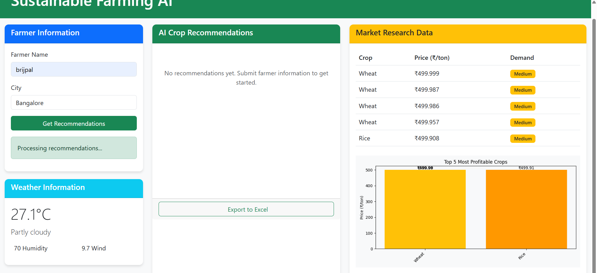
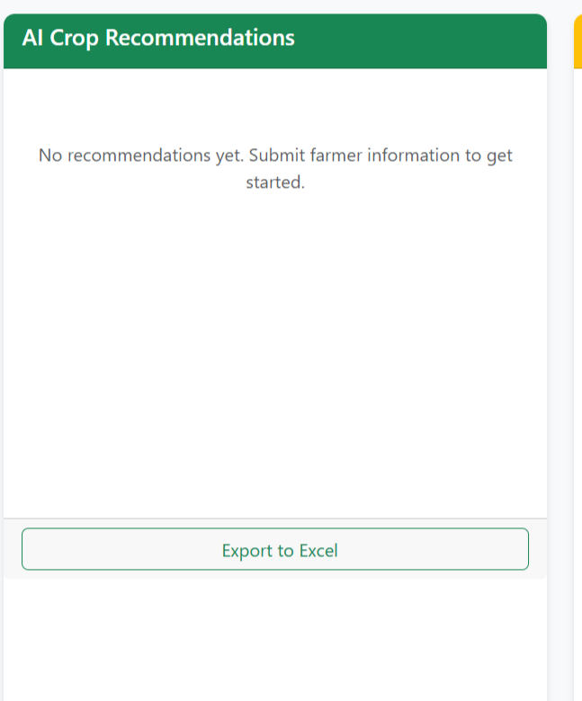
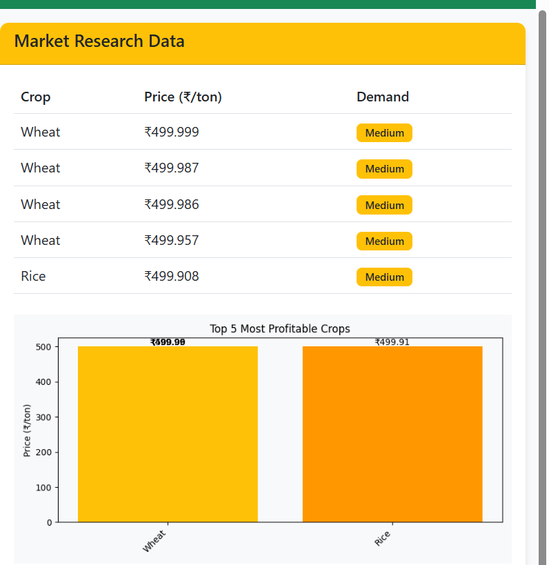

<h1 align="center" style="color: #2E8B57;">🌱 Sustainable Farming AI Dashboard</h1>
<p align="center">
  
  
  
  
</p>

---

## 📖 Introduction
### **Significance of the project**
This project demonstrates how Artificial Intelligence can be applied to sustainable agriculture, helping farmers make data-driven decisions for crop selection based on **weather, soil data, and market trends**.

---

## 💻 Technology Specification
### **a. Languages Learned**
- **Python** (Backend, AI model integration)  
- **JavaScript** (Frontend interactivity)  
- **HTML/CSS** (UI structure & styling)  

### **b. Tools & Technologies**
- **Flask** – Backend API  
- **Matplotlib** – Data Visualization  
- **Ollama AI** – Crop recommendations  
- **Bootstrap 5** – Responsive design  
- **SQLite** – Lightweight database  

---

## 🚀 Project Description
The **Sustainable Farming AI Dashboard**:
- Fetches **real-time weather data**
- Analyzes **soil & environmental factors**
- Uses AI to suggest **sustainable crops**
- Shows **market prices** and **profitability charts**
- Allows **data export** to Excel

---

## 🖼 Snapshots
| Feature | Screenshot |
|---------|------------|
| Dashboard Home |  |
| AI Recommendations |  |
| Market Data & Charts |  |

---

## ⚠ Limitations & 🎯 Learning Outcomes
**Limitations**
- Depends on dataset quality for AI accuracy  
- AI model requires fine-tuning for regional crops  

**Learning Outcomes**
- Integration of **multi-agent AI system**  
- Backend-frontend synchronization  
- Data visualization techniques  
- Hands-on with **Flask, Ollama AI, and Chart rendering**

---

## 🔮 Future Scope
- Integration with **IoT devices** for real-time soil data  
- **Mobile App** version for farmers  
- Multilingual support for better accessibility  
- Blockchain for **secure agricultural transactions**

---

## 📂 Project Setup - Clone & Run
```bash
# Clone the repository
git clone https://github.com/725aayush/SUSTAINABLE_FARMING_DASHBOARD.git

# Navigate into the project
cd SUSTAINABLE_FARMING_DASHBOARD

# Install dependencies
pip install -r requirements.txt

# Run Flask app
python main.py
